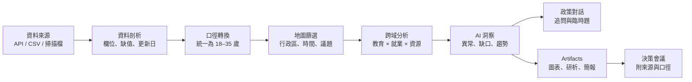

# YouthLM 前端產品與落地規劃（9/1 會議版）

## 1. 先定義產品，不再做一個泛用 AI 聊天室

**產品定位：YouthLM 是給承辦人與政策分析幕僚使用的「青年政策證據工作台」**。操作端把分散的政府資料拖入白板，系統協助清理、統一年齡口徑、交叉分析與地圖化，再把有來源依據的洞察交給對話與 Artifacts，直接產出政策制定者在會議中可使用的圖表、摘要和簡報。

建議今晚對外統一的一句話：

> 操作簡單的青年政策決策工作台：從分散資料，到可信、可追溯的青年政策答案。

簡報首頁可以只保留更短的標語：「**從分散資料，到可信的青年政策答案。**」口頭介紹時再補上「可追溯」與完整工作流，避免一句話承擔太多資訊。

### A–D 產品敘事對照

| 項目 | 會議版定義 | 對前端的直接影響 |
| --- | --- | --- |
| A. 使用者 | 主要操作者：承辦人、政策分析幕僚；成果使用者：政策制定者 | 介面優先支援分析編排與證據整理，匯報模式則降低操作複雜度 |
| B. 真正痛點 | 固定流程存在，但跨系統、耗時、難比較、臨時問題難回答 | 首頁要把完整流程與執行進度呈現出來，不只放結果圖表 |
| C. 產品價值 | 從分散資料到可信的青年政策答案 | 每個答案都要能回查資料、口徑、篩選與方法 |
| D. 解法 | Dashboard 點查、ChatBot 追問與簡報、政策雷達、資料轉換、自由加資料 | 白板負責流程，Dashboard 負責察覺，Chat 負責臨時問題，Artifacts 負責交付 |

### 今晚可以直接使用的 A–D 說法

**A. 使用者**

YouthLM 主要給青年政策承辦人與政策分析幕僚使用。他們用系統整理資料、完成分析並準備會議材料；政策制定者則閱讀這些成果，用來判斷政策方向。

**B. 真正痛點**

問題不只是資料分散。承辦人每遇到一個政策問題，都得重新找資料、清理口徑、交叉比對、做圖，再把結果整理成簡報。這套流程花時間，也很難在會議現場回答臨時追問。尤其資料的年齡定義不同時，使用者很難快速判斷哪些結果能比較、哪些只能估算。

**C. 產品價值**

簡報標語：

> 從分散資料，到可信的青年政策答案。

口頭補充：

> YouthLM 把資料整理、交叉分析、地圖探索和簡報輸出放在同一個工作流裡，每個結論都能查回資料來源與轉換方式。

**D. 解法**

使用者可以加入政府 Open API、CSV 或既有報告，再用白板安排資料清理與分析流程。Dashboard 透過地圖和圖表找出行政區差異；政策雷達主動提出異常或資源缺口；遇到臨時問題時，可直接在目前證據範圍內追問，最後把選取的結果整理成會議摘要或簡報。

**為什麼不是普通 Dashboard + ChatBot？**

一般 Dashboard 只能查看事先做好的指標，ChatBot 也常看不到資料怎麼被整理。YouthLM 讓使用者自行加入資料，公開顯示年齡口徑與轉換規則，並替每個回答保留來源。政策雷達和 Artifacts 也沿用同一份證據，不必重做一次分析。

### 30 秒口頭版本

> YouthLM 主要給青年政策承辦人和分析幕僚使用。他們不是沒有分析流程，而是每次都要重新找資料、整理口徑、交叉比對、做圖和做簡報，開會時還得回答臨時問題。我們把這段工作變成一個可視化流程：資料可以自由加入，系統會顯示怎麼清理和轉換，再用地圖、政策雷達和 AI 找出問題。最後產出的每張圖、每個回答都能查回來源，也能直接整理成會議簡報。

### 命題文件與本專案需求的分界

命題文件是**需求來源**，不是要由前端照做的操作指令。其明確要求可整理為：

- 對象以《青年基本法》的 **18–35 歲**為主。
- 整合 API、CSV、掃描檔等異質資料。
- 處理不同資料源的年齡層定義衝突，而非只把檔案放在同一頁。
- 支援教育、就業等跨域交叉比對與視覺化。
- 建立可抓取、清理資料的 pipeline，形成動態決策儀表板。
- 能提供就業、教育等資源需求趨勢或預測，協助政策決策。

使用者另外指定的產品形式是：n8n 式白板、可自由增加的資料模組、對話、Artifacts、政策雷達、資料轉換工具，以及地圖熱點篩選。前端應把兩者合成一條完整故事，而不是把功能各自散落在側欄。

## 2. 評審應該在 30 秒內看懂的主流程



畫面第一次載入就應展示一條已跑完的範例工作流，避免評審面對空白白板。推薦 Demo 問題：

> 新北哪些行政區的 18–35 歲青年就業風險升高，但職訓或教育資源尚未跟上？

這個問題可自然串起目前原型已有的職訓與就業故事，也能展示命題要求的跨域整合、地圖察覺問題、政策追問和簡報輸出。

## 3. 單一工作台的資訊架構

### 白板、Dashboard 與 Chat 的分工

三者不應互相競爭首頁位置，而是同一條決策流程中的不同工具：

- **白板是分析編排層**：讓承辦人看懂資料怎麼進來、怎麼被轉換與交叉比對。
- **Dashboard 是察覺與篩選層**：地圖、指標、雷達與圖表都由節點產生，並在匯報模式組成可點擊的決策面板。
- **Chat 是臨時問題層**：只針對目前選取的資料與證據追問，不取代資料清理與視覺化。
- **Artifacts 是交付層**：把釘選證據轉成報告、摘要與簡報。

因此評審看到的不是「普通 Dashboard 再加一個聊天窗」，而是能新增資料、公開轉換口徑、保留證據鏈，並持續產出決策材料的工作流。

### 頂部：專案與執行狀態

- 左側：YouthLM、專案名稱、最近儲存時間。
- 中間：`探索模式` / `匯報模式`。探索模式操作節點，匯報模式把已釘選的證據整理成敘事順序。
- 右側：執行工作流、Demo 模式標示、分享／匯出。
- 不在瀏覽器顯示 AWS 金鑰、資料庫密碼或任何後端秘密。

### 左側：Source Hub

左欄由現在的 Library 擴充為三個頁籤：

1. **資料來源**：API、CSV、Excel、PDF／掃描檔；可搜尋、拖入白板、查看更新日與欄位數。
2. **資料工具**：欄位選取、重新命名、型別轉換、缺值處理、年齡口徑統一、資料合併。
3. **政策雷達**：新資料上架、指標突變、資料過期、行政區資源落差；每則雷達可直接建立一條分析分支。

新增資料採 3 步驟精靈：選來源 → 預覽與欄位對應 → 儲存並建立資料節點。比賽版先支援 CSV 上傳與預先設定的 Open API；掃描檔可做成「已解析範例」，不要在前端承諾完整 OCR。

### 中央：n8n 式工作流白板

白板是產品主角，不是裝飾。節點分成六類，每個節點都顯示執行狀態、輸入／輸出、資料筆數、更新時間和錯誤：

| 節點 | MVP 顯示內容 | 主要操作 |
| --- | --- | --- |
| 資料來源 | 名稱、格式、欄位、更新時間 | 預覽、重新整理、拖接 |
| 資料轉換 | 口徑規則、轉換前後筆數、警告 | 編輯規則、檢視差異 |
| 地圖熱點 | 新北行政區地圖、圖例、主要篩選 | 點區域、切指標、加入證據 |
| 交叉分析 | 指標關聯、區域排名、趨勢圖 | 改維度、檢視方法 |
| 政策雷達 | 異常／缺口卡與嚴重度 | 釘選、建立分析 |
| 對話／Artifacts | 目前引用節點與輸出摘要 | 追問、產出、匯出 |

建議把目前自行實作的拖曳、縮放與連線改為 `@xyflow/react`。React Flow 已提供拖曳、縮放、選取、連線、背景、控制列與客製節點能力，可把有限時間集中在政策節點本身，而不是持續維護畫布手勢。[React Flow 官方文件](https://reactflow.dev/)

### 右側：Inspector / Evidence / Artifacts

右側不是一直佔寬的輸出清單，而是依目前選取物件切換：

- **Inspector**：節點設定、欄位、篩選、執行紀錄。
- **Evidence**：資料來源、時間範圍、年齡定義、轉換規則、方法與限制。
- **Artifacts**：已釘選圖表、政策摘要、研析報告、會議簡報。

桌面版同時只開一個側欄，或讓側欄推擠並自動 Fit 白板；不可像現況一樣左右面板同開後遮住分析節點。

## 4. 地圖熱點是主要篩選器，不只是一張圖

行政區資料應用 **分級設色圖（choropleth）** 表示各區指標；只有就服站、課程、活動等點位資料才疊加真正的熱點層。這樣不會把「區域比率」誤畫成點密度。

地圖節點最少要有：

- 指標：青年失業率、職訓涵蓋率、教育落差或政策資源缺口。
- 時間：年度／季度。
- 年齡：預設 18–35；若原始資料無法精確換算，明確標示 `估算`、`部分相容` 或 `不相容`。
- 行政區：全市或多選行政區。
- 圖例：數值單位、資料缺漏、估算狀態，不只靠顏色傳意。
- 點選行政區後，整條工作流與右側證據同步交叉篩選。
- `加入證據`：保存當下指標、篩選、資料版本與截圖，供 Artifacts 使用。

MVP 不需要同時做所有地圖模式。先完成「新北行政區分級設色 + 點選連動 + 證據保存」，點位熱點可列為第二順位。

## 5. 資料轉換必須成為可見的競賽亮點

命題文件特別指出年齡定義衝突，因此不能把清理藏在 loading 畫面中。選取資料轉換節點後，右側顯示：

- 原始口徑，例如 15–24、25–34、35–44。
- 目標口徑 18–35。
- 採用的轉換規則與可計算程度。
- 轉換前後筆數、捨棄筆數與缺值。
- 可追溯的警告：若只有彙總年齡區間，前端不得呈現成「精確轉換」，應標示估算方法與限制。

這個可視化的「口徑履歷」會比單純展示 AI 回答更能直接命中命題。

## 6. 對話與 Artifacts 的產品規則

### 對話

- 對話預設只引用使用者勾選的節點與已釘選證據，並在回答上方列出目前範圍。
- 每段政策結論附來源 chip；展開後看得到資料集、期間、行政區、年齡口徑與分析方法。
- 提供 3 個評審容易操作的建議追問，例如「為什麼板橋被列為高風險？」、「如果職訓量增加 10% 呢？」、「做成局務會議摘要」。
- 若資料不足，回答應顯示缺口，不要產生看似精確的虛構百分比。

### Artifacts

比賽版保留四種輸出即可：

1. 圖表卡：可回到原節點與篩選狀態。
2. 政策重點：問題、發現、建議、限制。
3. 議題研析報告：可預覽並匯出。
4. 會議簡報：5 頁固定模板，依序為問題、資料、地圖、洞察、建議。

每個 Artifact 都要保存 `來源 + 資料版本 + 篩選條件 + 年齡口徑 + 產生時間`。這是從「漂亮圖」升級成「可用證據」的關鍵。

## 7. 今晚要鎖定的畫面與優先級

### P0：9/12 前一定要能完整走完

- 已跑完的 Demo 工作流首頁。
- 新增 CSV／預設 API 的資料流程。
- 可見的年齡口徑轉換節點。
- 新北行政區地圖節點與交叉篩選。
- 一個教育 × 就業 × 職訓的分析結果。
- 政策雷達最小版：至少顯示一則有來源的異常／資源缺口，並可點擊「建立分析」。
- 帶來源的政策對話。
- 一鍵產出政策重點與 5 頁簡報預覽。
- 後端失聯時可切換的明示 `Demo mode`，不可悄悄把假資料冒充即時資料。

### P1：有餘裕再加

- 政策雷達的真正排程、主動資料更新通知與多種偵測規則。
- 儲存與重開工作流。
- 點位型熱點圖層。
- 分享唯讀連結、比較兩次執行結果。

### P2：賽後

- 多人即時協作、留言、權限管理。
- 任意複雜分支與完整排程器。
- 手機版白板編輯；比賽前只需確保平板可檢視，Demo 以 1366px 以上桌面為準。

今晚至少確認 5 個 Hi-Fi 狀態：

1. 工作流總覽（預設 Demo 已完成）。
2. 新增資料與欄位預覽。
3. 年齡口徑轉換差異。
4. 行政區地圖點選與證據側欄。
5. 會議簡報 Artifact 預覽。

## 8. 現有程式的改造方式

現況可保留的部分：清爽的工作台風格、左右 rails、拖曳節點概念、資料庫／對話／Studio 的初步分工。

需要優先改造的部分：

- `src/app/App.tsx` 已把白板狀態、節點、側欄與內容全部放在單一檔案，應在 9/2 前拆分，降低後端串接風險。
- 把硬編碼的英文範例與 14.2% 結論改成繁中 Demo 資料模型，不要把示例數字散落在 JSX。
- 用節點 registry 管理節點種類；資料與執行狀態放在 store，不放在單一元件區域 state。
- 地圖、圖表、對話與 Artifacts 都透過同一個 `EvidenceRef` 結構傳遞來源與篩選。
- 解決 `/favicon.ico` 404，並補上 loading、empty、error、partial-data、offline-demo 等狀態。

建議目錄：

```text
src/
  app/
    AppShell.tsx
    workspace/WorkspacePage.tsx
  components/
    canvas/WorkflowCanvas.tsx
    nodes/DataSourceNode.tsx
    nodes/TransformNode.tsx
    nodes/MapNode.tsx
    nodes/AnalysisNode.tsx
    nodes/ChatNode.tsx
    panels/SourceHub.tsx
    panels/EvidenceInspector.tsx
    artifacts/ArtifactPreview.tsx
  features/
    datasets/
    workflow/
    map/
    chat/
    artifacts/
  services/api.ts
  store/workspace.ts
  types/domain.ts
  demo/fixtures.ts
```

核心前端型別先固定為 `Dataset`、`WorkflowNode`、`WorkflowEdge`、`Run`、`EvidenceRef`、`Artifact`。這會讓前後端能平行工作。

## 9. 前後端 API 契約與 AWS 落地

前端不要直接知道 n8n、模型或資料庫細節，只依賴穩定 API：

| 功能 | 建議契約 | 前端行為 |
| --- | --- | --- |
| 資料清單 | `GET /api/datasets` | 顯示來源、版本、健康狀態 |
| 檔案上傳 | `POST /api/uploads/presign` | 取得預簽網址後直接上傳物件儲存 |
| 執行工作流 | `POST /api/workflows/{id}/runs` | 回傳 `runId`，節點進入 queued/running |
| 查詢進度 | `GET /api/runs/{runId}` | 比賽版先用短輪詢，完成後更新節點 |
| 政策追問 | `POST /api/chat` | 傳送問題與 `evidenceRefs` |
| 產出文件 | `POST /api/artifacts` | 取得預覽資料或下載網址 |

AWS 前端建議採最少移動部件的 SPA 架構：Vite `dist/` 放私有 S3，由 CloudFront 發佈；`/api/*` 轉到 API Gateway，再接比賽後端；檔案用預簽網址直接傳 S3。官方亦提供 React SPA 使用 S3、CloudFront 與 API Gateway 的部署模式。[AWS Prescriptive Guidance](https://docs.aws.amazon.com/prescriptive-guidance/latest/patterns/deploy-a-react-based-single-page-application-to-amazon-s3-and-cloudfront.html)

前端至少準備三個環境變數：

```text
VITE_API_BASE_URL
VITE_APP_ENV
VITE_DEMO_MODE
```

部署前需向主辦／後端確認：提供的 AWS 帳號與區域、是否強制使用特定服務、網域／TLS、登入方式、上傳大小、API timeout，以及是否允許 WebSocket。這些不在目前命題 PDF 中，不能自行假設。

## 10. 9/1–9/12 交付節奏

| 日期 | 前端交付 | 必要驗收 |
| --- | --- | --- |
| 9/1 晚上 | 鎖產品故事、P0、5 個畫面、Demo 問題 | 全員能用同一句話說明產品 |
| 9/2–9/3 | 拆 App、導入節點框架、完成 Source Hub 與 Demo fixtures | 可新增資料節點並跑假工作流 |
| 9/4–9/5 | 年齡轉換、行政區地圖、篩選與 Evidence | 點一個區即可連動圖表與證據 |
| 9/6–9/7 | 對話、Artifacts、政策雷達最小版 | 可從洞察產出 5 頁簡報預覽 |
| 9/8 | 串接正式 API、上傳與執行進度 | 成功／失敗／逾時狀態都可見 |
| 9/9 | 第一次 AWS 全流程部署 | 新環境可由零部署並開啟 Demo |
| 9/10 | 資料與 Demo 流程凍結、斷線備援 | 後端斷線仍可明示 Demo mode 完成展示 |
| 9/11 | 1440×900 投影 QA、效能、繁中、彩排 | 3 分鐘與 7 分鐘版本都能走完 |
| 9/12 | 僅修阻斷問題，使用已驗證部署 | 不臨時換資料、套件或主流程 |

## 11. 今晚會議一定要做出的決定

1. Demo 問題是否採「青年就業風險 × 職訓／教育資源落差」。
2. P0 的實際資料源各一個：人口／就業、教育、職訓或資源點位。
3. 哪些結果是真實運算，哪些是明示 Demo fixtures。
4. 年齡 18–35 的轉換規則與無法精確轉換時的顯示原則。
5. 前端、後端、資料、簡報各一位最終 owner。
6. 9/8 API freeze、9/9 AWS rehearsal、9/10 Demo freeze 是否共同承諾。
7. 主辦提供的 AWS 限制由誰在 9/2 前確認。

## 12. Definition of Done

前端完成不是「畫面都有」，而是評審可以在一次不剪接的流程中：

1. 看見至少三個資料來源進入白板。
2. 看懂 18–35 歲口徑如何被處理及其限制。
3. 在地圖選取行政區並看到跨域結果更新。
4. 追問一個臨時政策問題，回答帶有可展開來源。
5. 把證據一鍵整理成會議摘要與簡報預覽。
6. 在 AWS 網址上完成同一流程；即使後端失聯，也有明示的可控備援。
